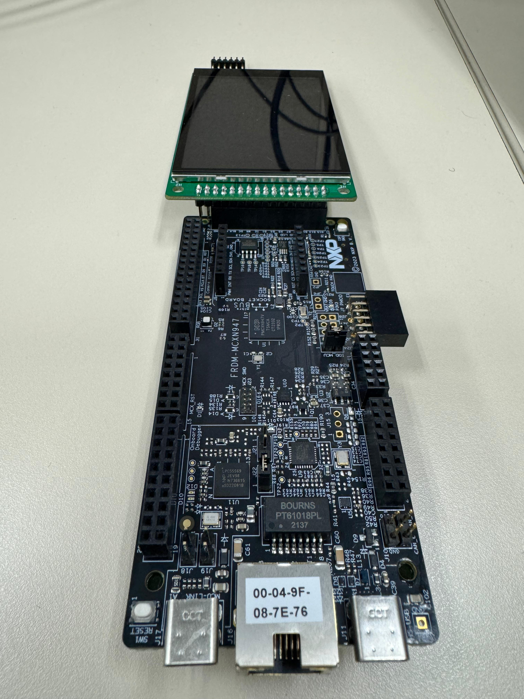
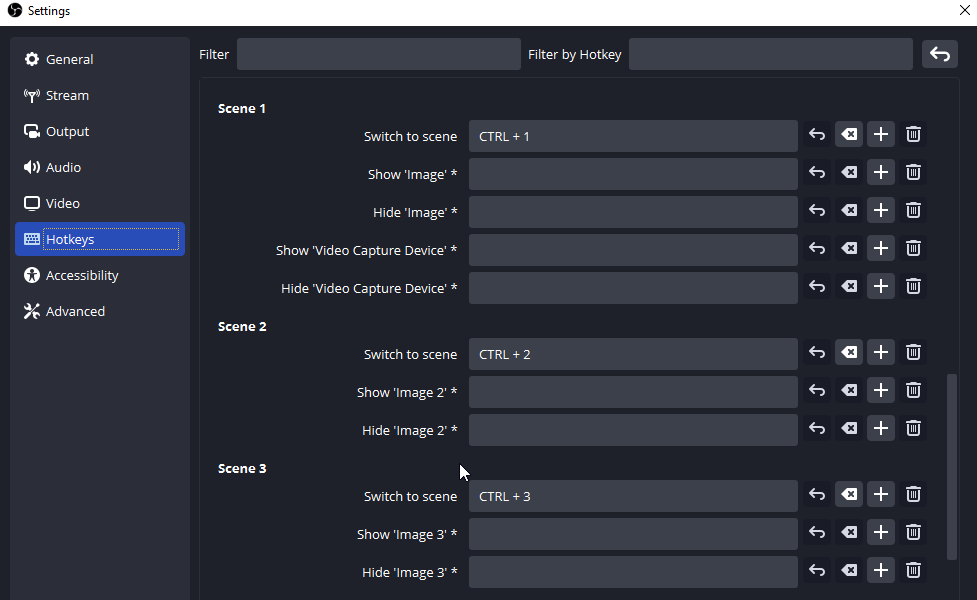

# NXP Application Code Hub
[](https://www.nxp.com)

## MCX STREAMDECK DEMO
A touch user interface to send hotkeys or shorcuts. this Demo can be configured with OBStudio to send hotkeys or shortcuts trough USB commands.


#### Boards: FRDM-MCXN947
#### Categories: Graphics, HMI
#### Peripherals: USB, DISPLAY
#### Toolchains: MCUXpresso IDE

## Table of Contents
1. [Software](#step1)
2. [Hardware](#step2)
3. [Setup](#step3)
4. [Results](#step4)
5. [FAQs](#step5) 
6. [Support](#step6)
7. [Release Notes](#step7)

## 1. Software<a name="step1"></a>
This code has been implemented using MCUXpresso IDE version 11.7.1. GUI Guider v1.6.0 was used to generate the initial design. LVGL (version 8.3.2) and all other software is included in MCUXpresso SDK - version 2.13.0 was used.

## 2. Hardware<a name="step2"></a>
- Purchase supported board:
    - [FRDM-MCXN947](https://www.nxp.com/part/FRDM-MCXN947#/)
    
- Purchase supported display: 
    - [LCD-PAR-S035](https://www.nxp.com/part/LCD-PAR-S035#/)
    - [TFT PROTO 5'' CAPACITIVE](https://www.mikroe.com/tft-proto-5-capacitive-board#/)

## 3. Setup<a name="step3"></a>

### 3.1 Step 1
Import the project into MCUXpresso IDE by following the following sections of the "MCUXpresso IDE - User Guide" found in the documentation section of the [MCUXpresso IDE page](https://www.nxp.com/design/software/development-software/mcuxpresso-software-and-tools-/mcuxpresso-integrated-development-environment-ide:MCUXpresso-IDE):


### 3.2 Step 2
Connect the Low Cost/MikroE Display to the board as shown in the following images:

Low Cost Display:

[](./doc/images/ConnectionLC.png)

MikroE Display:

[](./doc/images/ConnectionME.png)

Connect the USB's type C from J17(MCU-LINK) to the computer and from J11(HS-USB) to the computer as shown in the following image:

[](./doc/images/USB.png)


### 3.3 Step 3
Open lvgl_guider.c located at source folder and select the mounted display
```
#define LowCostDisplay 		1
#define MikroEDisplay 		2
#define LCD 				LowCostDisplay
```
### 3.4 Step 4
Press Alt+Enter to open properties and change the display macro to use the mounted board

LCD_SSD1963 to use the Micro E LCD

LCD_ST7796S_IPS to use the Low Cost LCD

as shown in the following image:
[](./doc/images/Properties.png)


### 3.5 Step 5
Open VSCode and set the same hotkeys/shortcuts as the selected in hid_keyboard.c in Source folder as shown in the following images

[](./doc/images/Settings.png)

<!---


-->


```
case kUSB_Direction1:/*clip 1*/
	s_UsbDeviceHidKeyboard.buffer[0] = MODIFERKEYS_LEFT_CTRL;
	s_UsbDeviceHidKeyboard.buffer[2] = KEY_1_EXCLAMATION_MARK;
	PRINTF("USB COMMAND 1");
                             
	break;
```

```
case kUSB_Direction3:/*clip 2*/
	s_UsbDeviceHidKeyboard.buffer[0] = MODIFERKEYS_LEFT_CTRL;
	s_UsbDeviceHidKeyboard.buffer[2] = KEY_2_AT;
	PRINTF("USB COMMAND 3");
	
	break;
```

```
case kUSB_Direction5:/*clip 3*/
	s_UsbDeviceHidKeyboard.buffer[0] = MODIFERKEYS_LEFT_CTRL;
	s_UsbDeviceHidKeyboard.buffer[2] = KEY_3_NUMBER_SIGN;
	PRINTF("USB COMMAND 5");

	break;
```

Now you can interact with the touch display to change beetwen scenes, mute/unmute, start recording or start streaming.

## 4. Results<a name="step4"></a>
Low Cost Display:

[](./doc/images/Clip1LCBoard.png)
[](./doc/images/Clip2LCBoard.png)
[](./doc/images/Clip3LCBoard.png)


Mikro E Display:

[](./doc/images/Clip1Board.png)
[](./doc/images/Clip2Board.png)
[](./doc/images/Clip3Board.png)


## 5. FAQs<a name="step5"></a>

## 6. Support<a name="step6"></a>
If you have any questions or feedback on this code please contact NXP support or post on our community at https://community.nxp.com/. You can find forums here for different aspects of this code example, including GUI Guider, MCUXpresso tools and device families.

#### Project Metadata
<!----- Boards ----->
[](https://github.com/search?q=org%3Anxp-appcodehub+FRDM-MCXN947+in%3Areadme&type=Repositories)

<!----- Categories ----->
[](https://github.com/search?q=org%3Anxp-appcodehub+graphics+in%3Areadme&type=Repositories) [](https://github.com/search?q=org%3Anxp-appcodehub+hmi+in%3Areadme&type=Repositories)

<!----- Peripherals ----->
[](https://github.com/search?q=org%3Anxp-appcodehub+usb+in%3Areadme&type=Repositories) [](https://github.com/search?q=org%3Anxp-appcodehub+display+in%3Areadme&type=Repositories)

<!----- Toolchains ----->
[](https://github.com/search?q=org%3Anxp-appcodehub+mcux+in%3Areadme&type=Repositories)

Questions regarding the content/correctness of this example can be entered as Issues within this GitHub repository.

>**Warning**: For more general technical questions regarding NXP Microcontrollers and the difference in expected funcionality, enter your questions on the [NXP Community Forum](https://community.nxp.com/)

[](https://www.youtube.com/@NXP_Semiconductors)
[](https://www.linkedin.com/company/nxp-semiconductors)
[](https://www.facebook.com/nxpsemi/)
[](https://twitter.com/NXP)

## 7. Release Notes<a name="step7"></a>
| Version | Description / Update                           | Date                        |
|:-------:|------------------------------------------------|----------------------------:|
| 1.0     | Initial release on Application Code Hub        | January 4<sup>th</sup> 2024 |

